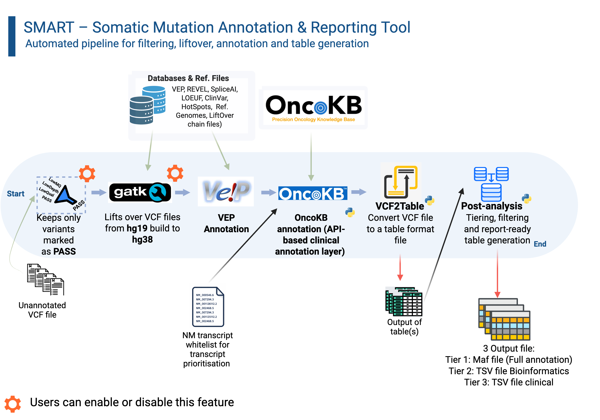

# SMART — Somatic Mutation Annotation and Reporting Tool <a href="#"></a>

<p align="center"><em>A Dockerised pipeline for somatic variant annotation, filtration, and clinical reporting.</em></p>

---

## Overview

SMART automates the end-to-end processing of somatic VCF files. Starting from raw VCFs (hg19/GRCh37 or hg38), it performs PASS filtering, optional coordinate liftover to GRCh38, comprehensive functional annotation via Ensembl VEP, clinical annotation via OncoKB, and produces final analysis-ready tables with transcript-prioritised results in three audience-targeted output tiers.

Everything runs inside a single Docker container.

---

## Workflow

<p align="center">
  
</p>

A streamlined framework for somatic variant annotation and clinical reporting.
SMART (Somatic Mutation Annotation and Reporting Tool) integrates sequential processing of somatic variants from input VCF files through quality filtering, optional liftover to GRCh38, and comprehensive functional annotation with Ensembl VEP. A key feature is transcript-level prioritisation using a curated NM whitelist to focus on clinically relevant isoforms. Variants are subsequently enriched with therapeutic, diagnostic and prognostic evidence via API-driven OncoKB annotation. Structured parsing of annotation layers enables standardisation and feature extraction, followed by tiering and filtering to produce report-ready outputs. The framework generates MAF and tabular outputs optimised for both bioinformatic analysis and clinical interpretation. While SNVs and indels are robustly supported, annotation of structural variants remains limited.

| Step | Tool | What happens |
|------|------|-------------|
| 1. PASS Filter | bcftools / awk | Keep only PASS-filtered variants |
| 2. LiftOver | GATK 4.6 | hg19 → hg38 coordinate conversion (optional) |
| 3. VEP Annotation | Ensembl VEP 114 | Functional annotation with SpliceAI, REVEL, ClinVar, CIViC, CancerHotspots, LOEUF plugins |
| 4. OncoKB Annotation | oncokb2.0.py | Per-variant clinical annotation via OncoKB REST API (mutations + CNAs) |
| 5. VCF → Table | vcf2table.py | Transcript-prioritised CSV with all VEP + OncoKB fields |
| 6. MAF Annotation | MafAnnotator | OncoKB MafAnnotator for standardised MAF output |
| 7. Post-Analysis | post_analysis.py | Merge samples, expand JSON fields, apply tier filtering, produce final outputs |

---

## Transcript Selection Strategy

Both the OncoKB annotator and the table generator use the same 3-tier logic to ensure the transcript shown in the final output matches the one used to query OncoKB:

**Tier 1 — Preferred List:** Does the annotation contain a RefSeq NM ID (version-agnostic) found in the transcript whitelist provided at runtime?

**Tier 2 — MANE Select / MANE Plus Clinical:** If no Tier 1 match, use the transcript tagged as MANE Select or MANE Plus Clinical by Ensembl/NCBI.

**Tier 3 — Fallback:** If neither applies, use the first transcript reported by VEP.

This logic applies to both SNV/indel and CNA variants, ensuring consistent gene selection when multiple transcripts overlap a region.

---

> [!NOTE]
> **v0.2.0 — multi-transcript output: one row per preferred transcript**
>
> When a variant overlaps more than one transcript in the preferred whitelist, the pipeline
> now produces **one output row per matching transcript**, each with its own VEP annotation
> and independent OncoKB query.
>
> This is clinically significant for genes with multiple biologically distinct isoforms.
> The canonical example in the TSO500 panel is **CDKN2A**:
>
> - `NM_000077.5` — p16/INK4A (CDK4/6 inhibitor; MANE Select)
> - `NM_058195.4` — p14ARF (MDM2/TP53 pathway; MANE Plus Clinical)
>
> A variant affecting both isoforms now appears **twice** in the output — once for each
> isoform — with the correct protein change and OncoKB evidence level for each.
> The `NM_Transcript` column identifies which isoform each row represents.

---

## What's Inside the Container

| Tool | Version | Purpose |
|------|---------|---------|
| GATK | 4.6.0.0 | LiftOver (hg19 → hg38) |
| Ensembl VEP | 114.2 | Functional annotation |
| SpliceAI plugin | 1.3 | Splice-site impact prediction |
| REVEL plugin | 1.3 | Missense pathogenicity scoring |
| bcftools / samtools / tabix | System | VCF manipulation |
| Python 3.10 | + pandas, cyvcf2, requests | Pipeline scripts |
| OncoKB Annotator | Latest | MafAnnotator for MAF output |

---

## Prerequisites

- **Docker** (v20.10+ or Docker Desktop)
- **OncoKB API token** — obtain from [oncokb.org](https://www.oncokb.org)
- **Reference files** downloaded and organised (see below)

---

## Reference Files Setup

SMART expects a reference directory with the following structure:

```
/path/to/refs/
├── liftover/
│   ├── hg19ToHg38.over.chain       # UCSC chain file
│   └── hg38.fa                      # GRCh38 reference genome + .fai + .dict
├── Plugins/                         # VEP plugin files (SpliceAI.pm, REVEL.pm, LOEUF.pm)
├── SpliceAI/
│   ├── spliceai_scores.raw.snv.hg38.vcf.gz      (+.tbi)
│   └── spliceai_scores.raw.indel.hg38.vcf.gz    (+.tbi)
├── REVEL/
│   └── new_tabbed_revel_grch38.tsv.gz            (+.tbi)
├── ClinVar/
│   └── clinvar.vcf.gz                            (+.tbi)
├── CIVIC/
│   └── civic_grch38.vcf.gz                       (+.tbi)
├── gnomAD_constraints/
│   └── loeuf_dataset_grch38.tsv.gz               (+.tbi)
├── CancerHotSpots/
│   └── hg38.hotspots_changv2_gao_nc.vcf.gz      (+.tbi)
└── homo_sapiens/                    # VEP cache directory
    └── 114_GRCh38/
```

All reference files can be downloaded using the provided `utils/get_ref_files.sh` script (see [utils/README.md](utils/README.md)).

---

## Quick Start

### 1. Clone and build

```bash
git clone https://github.com/kaine-veal/SMART.git
cd SMART
docker build -t smart:latest .
```

### 2. Add your data

```bash
mkdir -p data/OriginalVcf
cp /path/to/your/*.vcf.gz data/OriginalVcf/
cp /path/to/transcripts_list.txt data/
```

### 3. Run

```bash
export ONCOKB_TOKEN=your_token_here

docker run --rm \
  -v /path/to/your/input:/data \
  -v /path/to/your/output:/output \
  -v /path/to/your/refs:/refs:ro \
  monkiky/smart:latest \
  "$ONCOKB_TOKEN" \
  --transcripts-file /data/transcripts_list.txt \
  --config /data/Config.yaml \
  --ref-dir /refs \
  --input-dir /data \
  --no-liftover \
  --keep-tmp \
  --keep-tables
```

For example, using the verification1 test set:

```bash
docker run --rm \
  -v /path/to/tso500_project/tests/verification1:/data \
  -v /path/to/tso500_project/tests/verification1/output:/output \
  -v /path/to/refs:/refs:ro \
  monkiky/smart:latest \
  "$ONCOKB_TOKEN" \
  --transcripts-file /data/verification1_transcripts.txt \
  --config /data/Config.yaml \
  --ref-dir /refs \
  --input-dir /data \
  --no-liftover \
  --keep-tmp \
  --keep-tables
```

Or with docker compose (edit `docker-compose.yml` volume paths first):

```bash
docker compose run --rm smart
```


---

## Command-Line Options

```
Usage:
  smart <ONCOKB_TOKEN> --transcripts-file FILE --ref-dir DIR [OPTIONS]

Required:
  <ONCOKB_TOKEN>                   OncoKB API token
  --transcripts-file FILE          Transcript whitelist for prioritisation
  --ref-dir DIR                    Reference resources directory

Options:
  --pass / --no-pass               Enable/disable PASS filtering (default: ON)
  --liftover / --no-liftover       Enable/disable hg19→hg38 liftover (default: ON)
  --clean-tmp / --keep-tmp         Delete/keep intermediate files (default: clean)
  --clean-tables / --keep-tables   Delete/keep per-sample tables after
                                   post_analysis merging (default: clean)
  --jobs N                         Number of samples to process in parallel on this
                                   machine (default: 1 = sequential). Requires
                                   internet access for OncoKB — not suitable for
                                   HPC compute nodes without internet.
  --help                           Show help
```

---

## Output

All results are written to the mounted `/data` directory:

| File | Description |
|------|-------------|
| `variant_counts.txt` | Per-sample variant counts at each pipeline stage |
| `Output_Results/` | Final merged results from post-analysis |

### Output tiers

The pipeline produces three audience-targeted output files:

| File | Audience | Contents |
|------|----------|----------|
| `Final_result_tier1.maf` | Downstream tools | All non-dropped fields in standard MAF format (~300–900 columns depending on the number of treatment, diagnostic, and prognostic implication entries returned by OncoKB for the variants in the run) |
| `Final_result_tier2.tsv` | Bioinformaticians | Selected fields with two-row header (field names + metadata) |
| `Final_result_tier3.tsv` | Clinical scientists | Clinically relevant fields with two-row header |

When `--keep-tmp` is used, intermediate files are retained:

| Directory | Contents |
|-----------|----------|
| `FilteredVcf/` | PASS-only VCFs |
| `LiftOverVcf/` | hg38-lifted VCFs |
| `LiftOverVcf/Rejected/` | Variants that failed liftover |
| `AnnotatedVcf/` | VEP-annotated VCFs |
| `OncoKB_VCF/` | OncoKB-annotated VCFs |
| `Table/` | Per-sample CSV tables |
| `FINAL_Table/` | Per-sample MAF files |

---

## Output Annotations (~300–900 columns) — [Full field reference →](https://kaine-veal.github.io/tso500_project/)

The final table includes annotations from multiple sources. Key field groups:

**Core VCF:** CHROM, POS, ID, REF, ALT, QUAL, FILTER, FORMAT

**VEP Functional:** Consequence, IMPACT, SYMBOL, HGVSc, HGVSp, BIOTYPE, EXON, INTRON, SIFT, PolyPhen, VARIANT_CLASS, CANONICAL, MANE_SELECT, MANE_PLUS_CLINICAL

**Population Frequency:** gnomADe/gnomADg allele frequencies across populations, MAX_AF

**Splice & Pathogenicity:** SpliceAI delta scores (AG/AL/DG/DL), REVEL missense score, LOEUF constraint

**Clinical Databases:** ClinVar (significance, review status, conditions), CIViC (variant type, consequence), CancerHotspots (hotspot and 3D hotspot flags)

**OncoKB Core:** Oncogenic classification, mutation effect, gene/variant exist flags, hotspot, VUS flag, gene and variant summaries

**OncoKB Therapeutic Levels:** LEVEL_1 through LEVEL_R2, HIGHEST_SENSITIVE_LEVEL, HIGHEST_RESISTANCE_LEVEL, HIGHEST_LEVEL, ONCOKB_highestFdaLevel

**OncoKB Diagnostic/Prognostic:** ONCOKB_DIAG_LVL, ONCOKB_PROG_LVL, ONCOKB_diagnosticSummary, ONCOKB_prognosticSummary

**OncoKB Expanded JSON:** Treatment, diagnostic, and prognostic implication entries are expanded from JSON arrays into individual columns (e.g. `ONCOKB_TX_0_level`, `ONCOKB_TX_0_drugs`, `ONCOKB_DIAG_0_level`, `ONCOKB_PROG_0_tumorType`, etc.), producing hundreds of additional columns for full structured access.

---

## Variant Classification

SMART classifies variants to route them to the correct OncoKB API endpoint:

| Variant Type | Examples | OncoKB Endpoint |
|-------------|----------|-----------------|
| Mutations | SNVs, indels, MantaINS, MantaBND | `/annotate/mutations/byProteinChange` |
| Copy Number | MantaDUP, MantaDEL, GAIN, LOSS | `/annotate/copyNumberAlterations` |

Structural insertions (MantaINS) are intentionally routed to the mutation endpoint because they alter gene sequence and produce specific protein changes (e.g. EGFR Exon 20 insertions) that require distinct targeted therapies, unlike simple gene dosage changes.

### CNA annotation

For copy-number variants, SMART applies the same 3-tier transcript selection logic to determine the correct gene symbol before querying OncoKB. This prevents misannotation in regions where multiple genes overlap (e.g. selecting CDKN2A over the adjacent CDKN2B for a 9p21 deletion).

Because MafAnnotator does not correctly annotate CNA rows, the pipeline's post-analysis step overrides MafAnnotator's output for CNA variants with values derived directly from the OncoKB API: `VARIANT_IN_ONCOKB`, `ONCOGENIC`, `MUTATION_EFFECT`, all treatment levels, and `HIGHEST_SENSITIVE/RESISTANCE_LEVEL`.

---

## Tumor Type Handling

SMART supports two modes for OncoKB tumour type context:

**`--tumor_mode filename`** (default in standalone script): Parses the input filename against a built-in cancer type dictionary to infer the tumour type for context-specific evidence levels.

**`--tumor_mode generic`** (default in Docker entrypoint): Omits `tumorType` from API queries for pan-cancer annotation, which returns broader evidence including FDA levels and treatment levels across all tumour types.

Supported filename-inferred types: brain, breast, cholangiocarcinoma, colon, endometrial, HNSC, SNUC, lung, melanoma, ovarian, pancreatic, prostate, renal, sarcoma, thyroid.

---

## Versioning

The pipeline version is recorded in the `VERSION` file at the repository root. It is printed in the terminal banner at the start of every run and written as the first line of every output MAF file (`#SMART_VERSION x.y.z`), making each result file self-describing and traceable to a specific release.

To check the version bundled in a Docker image:

```bash
docker run --rm monkiky/smart:latest cat /app/VERSION
```

---

## Tool Versions

| Component | Version |
|-----------|---------|
| SMART | see `VERSION` |
| VCF format | 4.2 |
| GATK LiftoverVcf | 4.6.0.0 |
| Ensembl VEP | 114.2 |
| OncoKB | 5.4 |
| SpliceAI | 1.3 |
| REVEL | 1.3 |
| CIViC | nightly |
| Reference genome | GRCh38 (Homo sapiens 114) |

---

## Utility Scripts

The `utils/` directory contains standalone helper scripts that operate **outside** the Docker container. See [utils/README.md](utils/README.md) for full details.

| Script | Purpose |
|--------|---------|
| `get_ref_files.sh` | Download and prepare all reference files required by the pipeline |
| `civic_formating.py` | Convert CIViC nightly TSV into a bgzip-compressed, tabix-indexed VCF for VEP |
| `get_oncokb_transcripts.py` | Fetch the canonical transcript (NM accession) OncoKB uses for every curated gene and write a ready-to-use transcript whitelist |

---

## Testing & Verification

The `tests/` directory contains four independent verification suites plus a shared utility. All automated suites can be run together:

```bash
export ONCOKB_TOKEN=your_token_here
bash tests/run_all_verifications.sh
```

To run a single suite:

```bash
bash tests/run_all_verifications.sh --only verification1
bash tests/run_all_verifications.sh --only verification3
bash tests/run_all_verifications.sh --only verification4
```

---

### Verification 1 — Field-level API verification

Located in `tests/verification1/`. Contains 18 curated variants (14 SNV/indel + 4 CNA) covering key clinical scenarios across NRAS, IDH1, PIK3CA, EGFR, BRAF, GNAQ, PTEN, KRAS, BRCA2, DICER1, TP53, ERBB2, MET, CDKN2A, and CDK4.

After running the pipeline, `verify.py` cross-checks the MAF output against live external APIs:

- **OncoKB module** — queries `oncokb.org/api/v1` for each variant; compares 23 fields including oncogenicity, mutation effect, all treatment/FDA/diagnostic/prognostic levels, and summaries
- **VEP module** — queries `rest.ensembl.org` for each SNV/indel; compares 14 fields including consequence, HGVSc/HGVSp, SIFT, PolyPhen, exon number, and canonical flag
- **CIViC module** — queries the CIViC GraphQL API for each variant; compares variant type, consequence, gene, and clinical significance

All modules report PASS / MISMATCH per field with a coverage report identifying which fields were testable and which were always empty.

```bash
python tests/verification1/verify.py \
    --maf  tests/verification1/output/output/Final_result_tier1.maf \
    --token $ONCOKB_TOKEN \
    --output tests/verification1/results.tsv
```

See `tests/verification1/README.md` for full details.

---

### Verification 2 — Variant caller compatibility

Located in `tests/verification2/`. Tests the pipeline against VCFs from four different variant callers (GATK MuTect2, Strelka, SomaticSniper, Pisces) using SEQC2 benchmark samples, verifying that SMART correctly handles different VCF formats, FILTER field conventions, and column orderings. This suite is run manually (see `tests/verification2/README.md`).

---

### Verification 3 — Transcript prioritisation impact

Located in `tests/verification3/`. Demonstrates that the preferred-transcript whitelist meaningfully changes the VEP annotation output and, downstream, the OncoKB clinical interpretation. The pipeline is run twice on the same three-variant VCF using two different transcript files, then `verify.py` confirms:

1. **DIFFER** — targeted variants produce different VEP annotations between runs (the whitelist drives annotation selection)
2. **PASS** — each run's annotation is confirmed correct by the Ensembl REST API for the expected transcript
3. **OncoKB impact** — the annotation difference propagates to a different clinical result (e.g. LEVEL_1 vs Unknown, CDKN2A LEVEL_4 vs CDKN2B with no level)

| Variant | Transcript A | Result A | Transcript B | Result B |
|---|---|---|---|---|
| EGFR L858R | NM_005228.5 (MANE) | p.Leu858Arg (LEVEL_1) | NM_001346897.2 | p.Leu813Arg (Unknown) |
| TP53 R175H | NM_000546.6 (MANE) | p.Arg175His (hotspot) | NM_001126115.2 | p.Arg43His (not a hotspot) |
| CDKN2A/B DEL | NM_058195.4 | CDKN2A (LEVEL_4) | NM_004936.4 | CDKN2B (no level) |
| FGFR1 N546K | NM_023110.3 (MANE) | p.Asn546Lys (Unknown) | NM_001174067.2 (TSO500 non-MANE) | p.Asn577Lys (Likely Oncogenic, LEVEL_4 — false positive) |

```bash
export ONCOKB_TOKEN=your_token_here
bash tests/verification3/run_verification3.sh
```

See `tests/verification3/README.md` for full details.

---

### Verification 4 — Parallel job processing (`--jobs`)

Located in `tests/verification4/`. Verifies that `--jobs N` correctly processes
multiple samples in parallel on a single machine, producing identical output to a
sequential run.

The `--jobs N` flag runs up to N samples concurrently as background processes on
the **same machine**, sharing its CPU and RAM. It is not distributed computing —
all jobs run inside the same Docker container. This is designed for machines with
internet access, since OncoKB requires internet connectivity that is typically
unavailable on HPC compute nodes.

The test copies `verification1.vcf.gz` twice under different sample names and
runs with `--jobs 2`. `verify.py` confirms — without any external API calls:

- Both per-sample log files exist in `logs/` and contain the completion marker
- `variant_counts.txt` has exactly one data row per sample (count-merge worked)
- Both output MAFs exist and are content-identical after excluding
  `Tumor_Sample_Barcode` (same input → same annotations)

```bash
export ONCOKB_TOKEN=your_token_here
bash tests/verification4/run_verification4.sh
```

See `tests/verification4/README.md` for resource guidance and implementation details.

---

### verify_maf.py — Expected variant presence

`tests/verify_maf.py` checks that specific known variants are present in a MAF output with the correct ID values. Used as a quick sanity check after a pipeline run.

---

## Troubleshooting

**"Required resource not found"**
Check that your `--ref-dir` volume mount is correct and the expected subdirectory structure exists. All `.vcf.gz` reference files need accompanying `.tbi` index files.

**Out of memory**
VEP annotation can be memory-intensive. Adjust the memory limit in `docker-compose.yml` under `deploy.resources.limits.memory`, or pass `--memory=32g` to `docker run`.

**VEP cache missing**
The VEP cache (`homo_sapiens/114_GRCh38/`) must exist inside your ref-dir. Download from Ensembl FTP and extract.

**Permission errors on output files**
The container runs as root by default. To match your host user:
```bash
docker run --rm -u $(id -u):$(id -g) ...
```

**OncoKB API errors**
Verify your token is valid and has not expired. The pipeline logs API errors to stderr — check your log file for `OncoKB mutation API ERROR` messages.

**Empty VCF after PASS filtering**
Some samples may have zero PASS variants. The pipeline will process these without error but the sample will show 0 counts in `variant_counts.txt`.

**CNA variants showing Unknown oncogenicity**
Ensure you are using an up-to-date build. Earlier versions of MafAnnotator incorrectly overwrote CNA annotation with Unknown values. The post-analysis step now corrects this automatically using values from the OncoKB API.

---

## License

This project is licensed under the MIT License — see the [LICENSE](LICENSE) file for details.

Copyright (c) 2026 University Hospital Southampton
